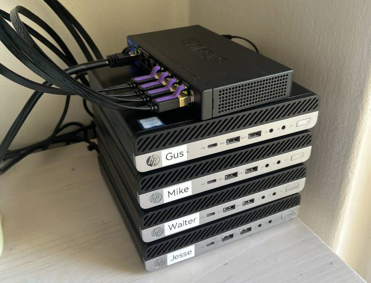

# Pollos

pollos is my homelab — a small cluster of Debian 13 boxes where every node is named after a Breaking Bad character (walter, jesse, mike, gus…). 
Pretty hostnames make each box easy to spot and a joy to SSH into. 
The scripts in [setup](setup) folder take a fresh Debian install and turn it into another member of the family.

You can easily install them from microsite: https://www.pollos.cz

## HW

- 4x HP ProDesk 600 G3 Mini i5-6500T (4 cores / 4 threads, 2.5–3.1 GHz)
- 4x SATA SSD Kingston 240GB
- 32GB DDR4 SO-DIMM per node (2x 16GB), running at 2133 MHz:

| Node   | DIMM1 / DIMM3       | Part              | Rank | ECC         | Speed |
|--------|---------------------|-------------------|------|-------------|-------|
| gus    | Kingston / Kingston | KF3200C20S4/16G   | 1    | no          | 2133  |
| mike   | Micron / Micron     | 18ASF2G72HZ-2G3B1 | 2    | yes (inert) | 2133  |
| walter | Micron / Micron     | 18ASF2G72HZ-2G3B1 | 2    | yes (inert) | 2133  |
| jesse  | Micron / Micron     | 18ASF2G72HZ-2G3B1 | 2    | yes (inert) | 2133  |



## SSH

```yml
# ~/.ssh/config

Host *.pollos
   User ansible
   # stored in 1password
   IdentityFile ~/.ssh/id_ed25519_homelab
   IdentitiesOnly yes

Host gus.pollos
  HostName 192.168.0.115

Host mike.pollos
  HostName 192.168.0.113

Host walter.pollos
  HostName 192.168.0.116

Host jesse.pollos
  HostName 192.168.0.117
```

### Ports

| Port | Service        | Notes                                              |
|------|----------------|----------------------------------------------------|
| 8004 | whisper-server | speech-to-text API, 127.0.0.1 only — SSH tunnel in |

## Apps

### Speech-to-text (whisper)

[setup/005-whisper.sh](setup/005-whisper.sh) builds [whisper.cpp](https://github.com/ggml-org/whisper.cpp) from source,
downloads the multilingual `large-v3-turbo-q8_0` model and runs `whisper-server` as a systemd service.
Any audio/video container works — the server converts via ffmpeg before inference.
The API binds to localhost only (SSH tunnel in) and the service is started on demand —
stopped it costs nothing, running it holds ~1.5 GB RAM:

```sh
# start (model loads in ~15 s; /health returns "loading model" until ready)
ssh walter.pollos -- sudo systemctl start whisper-server

ssh -L 8004:127.0.0.1:8004 walter.pollos

# plain text
curl -F file=@video.mp4 -F response_format=text http://127.0.0.1:8004/inference

# subtitles, force Czech (default is language auto-detect)
curl -F file=@video.mp4 -F response_format=srt -F language=cs http://127.0.0.1:8004/inference

# done — free the RAM
ssh walter.pollos -- sudo systemctl stop whisper-server
```

