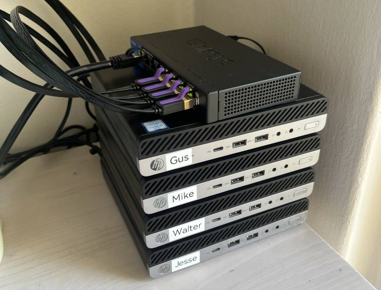

# Pollos

pollos is my homelab — a small cluster of Debian 13 boxes where every node is named after a Breaking Bad character (walter, jesse, mike, gus…). 
Pretty hostnames make each box easy to spot and a joy to SSH into. 
The scripts in [setup](setup) folder take a fresh Debian install and turn it into another member of the family.

You can easily install them from microsite: https://www.pollos.cz

Everything around the boxes — DNS, the microsite, health tunnels, uptime
monitors and the Tailscale tailnet — is Terraform in [infra](infra/README.md),
applied by CI on merge. The same health tunnel and monitor cover the Raspberry
Pi [nas](../nas/README.md), which runs its connector alongside its main tunnel
via [setup/006-health-sidecar.sh](setup/006-health-sidecar.sh). That README also holds the credential list and the
runbooks for enrolling a box.

The boxes boot into the `powersave` CPU governor; [setup/governor.sh](setup/governor.sh) `install` pins them to `performance` across reboots (`sudo governor powersave` to back off).

## HW

- 4x HP ProDesk 600 G3 Mini i5-6500T (4 cores / 4 threads, 2.5–3.1 GHz)
- 4x SATA SSD Kingston 240GB
- 32GB DDR4 SO-DIMM per node (2x 16GB), running at 2133 MHz:

| Node   | DIMM1 / DIMM3       | Part              | Rank | ECC         | Speed |
|--------|---------------------|-------------------|------|-------------|-------|
| gus    | Kingston / Kingston | KF3200C20S4/16G   | 1    | no          | 2133  |
| mike   | Micron / Micron     | 18ASF2G72HZ-2G3B1 | 2    | yes (inert) | 2133  |
| walter | Micron / Micron     | 18ASF2G72HZ-2G3B1 | 2    | yes (inert) | 2133  |
| jesse  | Micron / Micron     | 18ASF2G72HZ-2G3B1 | 2    | yes (inert) | 2133  |

### gus: 8 TB USB disk

Seagate SkyHawk `ST8000VE001-3CC101` (7200 rpm, 3.5"), in a Ugreen USB 3 to SATA
adapter (ASMedia ASM1153, UAS) with its own power. It shows up as `/dev/sdb`.
It came second-hand with a BitLocker volume on it, wiped on 2026-09-27.

One GPT partition, ext4, label `SkyHawk8tb`, no reserved blocks (`-m 0`),
mounted at `/mnt/SkyHawk8tb`. The `/etc/fstab` line goes by UUID and carries
`nofail` so gus still boots with the disk unplugged:

```
UUID=<uuid> /mnt/SkyHawk8tb ext4 defaults,noatime,nofail,x-systemd.device-timeout=10s 0 2
```

`~/SkyHawk8tb` on the `ansible` user is a symlink to the mount point.

Unplugging it:

- **At boot** it is harmless: `nofail` makes the disk optional, so gus boots
  without it and the mount is simply missing. Without `nofail` a missing disk
  drops the box into emergency mode.
- **While running**, unmount first, `sudo umount /mnt/SkyHawk8tb`, or whatever
  is mid-write can be lost and the filesystem may need a repair. Plugged back in,
  `sudo mount /mnt/SkyHawk8tb` or a reboot brings it back; the UUID finds it
  whatever `sd*` name it gets this time.
- **While it is not mounted**, `/mnt/SkyHawk8tb` and the symlink are an empty
  folder on the 240 GB system SSD. Anything written there, a backup job say,
  quietly fills the system disk instead of failing. `sudo chattr +i` on the empty
  mount point, done while unmounted, makes those writes fail loudly and does not
  affect the mounted disk.

Baseline on 2026-09-27, to compare later readings against:

| What | Value |
|------|-------|
| SMART overall | PASSED |
| Power-on hours | 1 324 (about 55 days), same in the Seagate FARM log, so not reset |
| Power cycles | 100 |
| Written / read | 6.8 TB / 110 GB |
| Reallocated, pending, uncorrectable sectors | 0 / 0 / 0 |
| Interface CRC errors | 0 |
| Temperature | 27 °C now, 55 °C lifetime max, 51 °C long-term average from its previous life |
| Self-tests | none run yet |

```sh
sudo smartctl -x -d sat /dev/sdb       # everything, what CrystalDiskInfo shows and more
sudo smartctl -l farm -d sat /dev/sdb  # Seagate's own log; catches reset SMART hours
sudo smartctl -t long /dev/sdb         # full surface read, about 12 h, non-destructive
```

The huge raw values on attributes 1, 7 and 188 are Seagate packing several
counters into one number, not errors. Watch attributes 5, 197 and 198: anything
above 0 there means the disk is starting to go.



## SSH

```yml
# ~/.ssh/config

# Every box is a Tailscale node, reachable by its MagicDNS name (== hostname).
# Keep Tailscale running on this Mac and one config works everywhere: at home
# Tailscale connects directly over the LAN at full speed, away it falls back to
# the encrypted tunnel — no exit node or subnet routes needed. Boxes join the
# tailnet via setup/005-tailscale.sh.
#
# (No per-host LAN probe on purpose: probing 192.168.0.x:22 adds a 1s timeout to
#  every connection when away, and on a foreign 192.168.0.0/24 network — hotel,
#  cafe — it can succeed against a stranger's box and trip host-key verification.
#  If Tailscale is ever off, the boxes are still reachable on the home LAN by raw
#  IP: gus 192.168.0.115, mike 192.168.0.113, walter 192.168.0.116,
#  jesse 192.168.0.117.)

Host gus.pollos
  HostName gus

Host mike.pollos
  HostName mike

Host walter.pollos
  HostName walter

Host jesse.pollos
  HostName jesse

Host *.pollos
   User ansible
   # stored in 1password
   IdentityFile ~/.ssh/id_ed25519_homelab
   IdentitiesOnly yes
```

### Ports

| Port | Service        | Notes                                              |
|------|----------------|----------------------------------------------------|
| 8004 | whisper-server | speech-to-text API, 127.0.0.1 only — SSH tunnel in |

## Apps

### Speech-to-text (whisper)

[../whisper](../whisper) — docker app wrapping [whisper.cpp](https://github.com/ggml-org/whisper.cpp)
`whisper-server` with the multilingual `large-v3-turbo-q8_0` model. On-demand: start it when
needed, stop it to free ~1.5 GB RAM; monitor with lazydocker or `make logs`.

```sh
ssh walter.pollos 'cd whisper && make up'

ssh -L 8004:127.0.0.1:8004 walter.pollos
curl -F file=@video.mp4 -F response_format=srt -F language=cs http://127.0.0.1:8004/inference

ssh walter.pollos 'cd whisper && make down'
```

See [../whisper/README.md](../whisper/README.md) for setup and all options.

